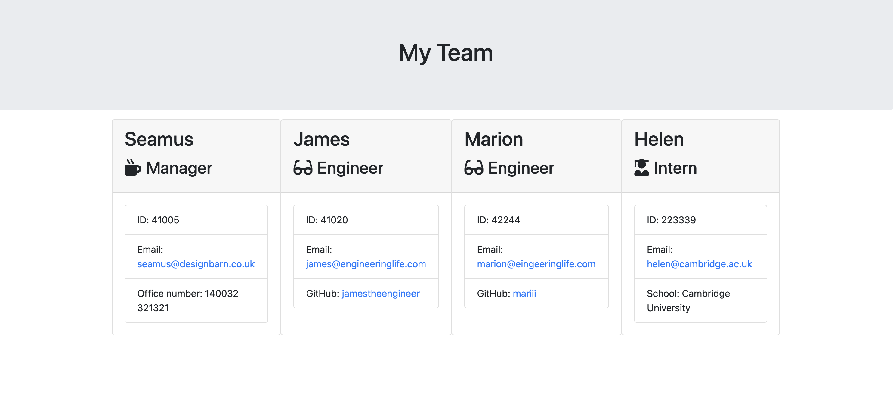
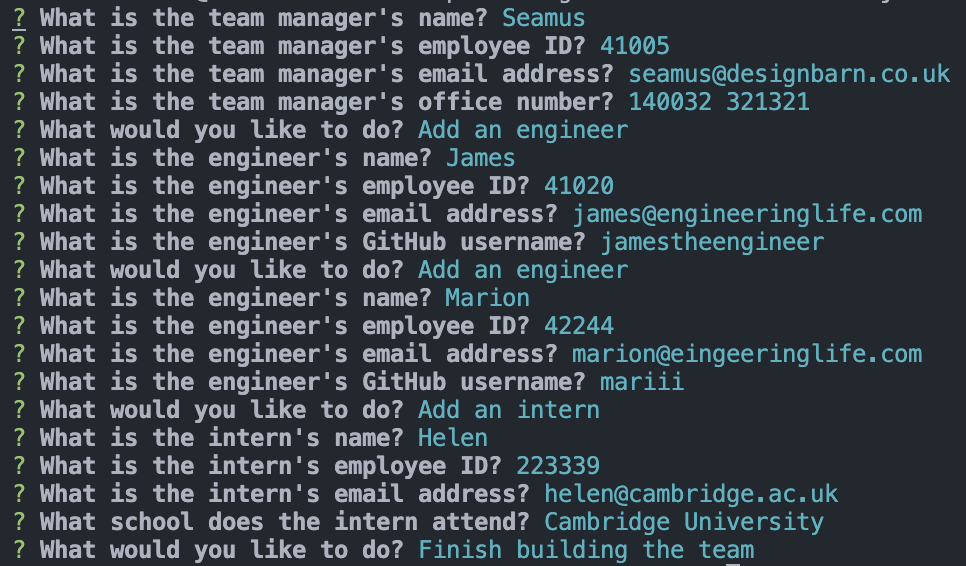

# Team profile Generator

[](https://opensource.org/licenses/MIT)

## Description

This application creates a team profile html page by asking you questions from the command line and formatting the answers.



## Installation

All you need to do is download the package. 

## Usage

Open up terminal, navigate to where the downloaded folder is and type the following command:
```javascript
node index.js
```
Answer the questions that pop up in the terminal window and once finished a new 'team.html' file will be created in the 'output' folder. Try opening it in a browser to see the results!



## MIT License

A short and simple permissive license with conditions only requiring preservation of copyright and license notices. Licensed works, modifications, and larger works may be distributed under different terms and without source code.

## Contributing

You are welcome to contribute to this project. Please submit a pull request.

## Questions

GitHub profile: <https://github.com/fawltya>

If you have any additional questions feel free to **[email me](mailto:seamus@designbarn.co.uk)**

